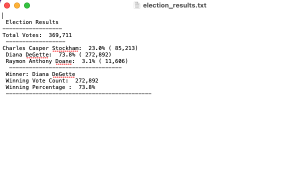
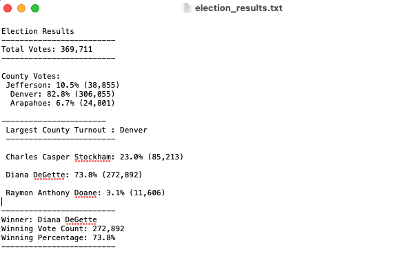

# Election-Analysis

Analysis for the Colorado Board of Elections.

## Overview of the Project

### Purpose 

The purpose of the project is, for Tom to analyze the Election dataset to perform the election audit needed by the Colorado Board of Elections. 
The following tasks included:

    1. Calculate the total number of votes cast.
    2. Get a complete list of candidates. 
    3. Calcualte the total number of votes each candidate received. 
    4. Calculate the percentage of votes each candidate won.
    5. Determine the winner of the election based on popular vote.

The data is stored in .csv file and it has ballot id ,name of the county and candidates.

### Initial Analysis 

Using Python script, the initial analysis were made to retrieve total number of votes, list of candidates,total number of votes of each candidates,percentage of votes each candidate won and the winner of the election.

[PyPoll](PyPoll.py) -  python file created to do the initial analysis.
 
Below is the image of  election results captured after the inital analysis made on election dataset. 

## Election Audit Results 

After completing the initial analysis and retrived informaiton on candidates, additional audits were made on the election dataset to retrive the information for county which included  voter turn out for each county,percentage of votes from each county,the county with the highest turn out. 

[PyPollChallenge](PyPoll_Challenge.py)- python file created to do the additional audit.  

Below is the image of the election results captured after the additional analysis made on election dataset.

∙  Total votes casted in the Congressional election : 369,711
•  County votes : 
        Jefferson: 10.5% (38,855)
        Denver: 82.8% (306, 055)
        Arapahoe: 6.7% (24,801)
•  Largest county turnout: Denver
•  Candidate votes :
        Charles Casper Stockham: 23.0% (85,213)
        Diana DeGette: 73.8% (272,892)
        Raymon Anthony Doane: 3.1% (11,606)
•  Winning Candidate : Diana Degette, 272,892 winning votes,73.8% winning percentage votes.   

## Eelection Audit Summary 

This Python script can be modified to find the most number of votes for different options other than candidates and county. If the dataset included demographics and geography, this script can be modified to include these options and the analysis can be made even deeper.

This script can also be used to find the percentage of voters by county for each candidate to determine which candidate had the most popular vote within a county. 

